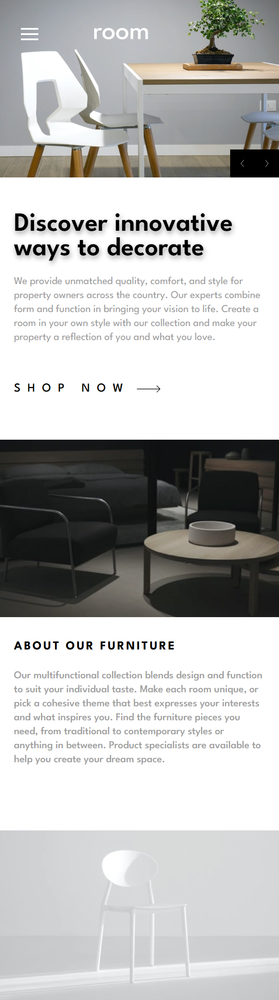
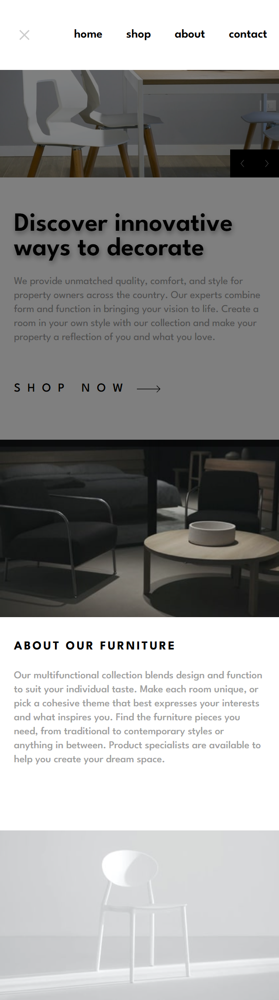
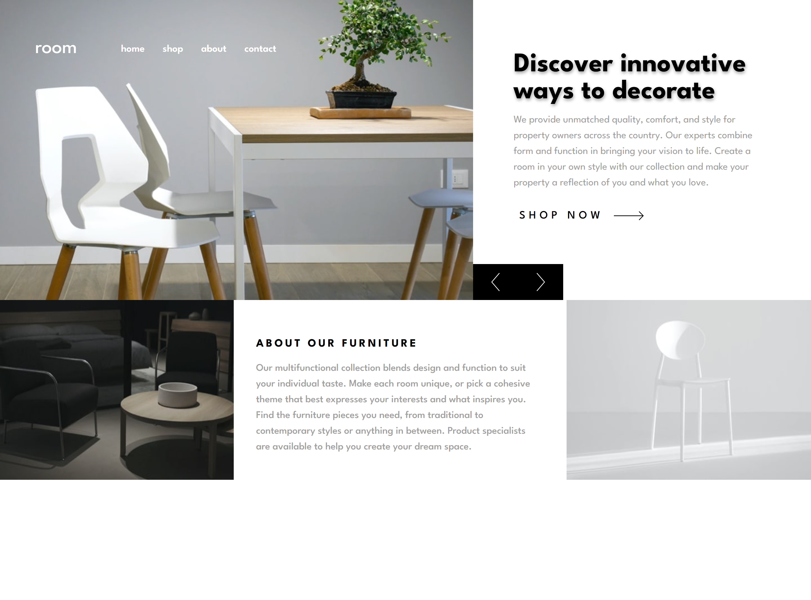

## Table of contents


- [Overview](#overview)
  - [The challenge](#the-challenge)
  - [Screenshot](#screenshot)
  - [Links](#links)
- [My process](#my-process)
  - [Built with](#built-with)
  - [What I learned](#what-i-learned)
  - [Continued development](#continued-development)
  - [Useful resources](#useful-resources)
- [Author](#author)
- [Acknowledgments](#acknowledgments)

## Overview

### The challenge

Users should be able to:

- View the optimal layout for the site depending on their device's screen size
- See hover states for all interactive elements on the page
- Navigate the slider using either their mouse/trackpad or keyboard

### Screenshot








### Links

- Solution URL: [GitHub Repository](https://github.com/Aggressive-Mohammed/room-home-page)

- Live Site URL: [site URL](https://amalitech-home-page.netlify.app/)

## My process

### Built with

- Semantic HTML5 markup
- CSS custom properties
- Flexbox
- CSS Grid
- Mobile-first workflow
  -TypeScript: For adding static types to JavaScript code, enhancing readability and maintainability
- [Tailwindcss](https://tailwindcss.com/) -CSS framework
- [React](https://reactjs.org/) - JS library -[Vite](https://vitejs.dev/) - Modern build tool

## What I learned

### TypeScript

1. TypeScript Basics: Understanding types, interfaces, and how TypeScript enhances JavaScript with static type checking.

2. React with TypeScript: Knowing how to create React components using TypeScript, including functional components and props typing.

### React

1. Component Structure: Understanding how to break down UI into reusable components.
2. React Router: Linking to other routes in your application.

### Tailwind CSS

1. Utility-First CSS: Applying styles using utility classes.
2. Responsive Design: Using responsive classes to adjust the layout for different screen sizes
3. Custom Styling: Applying custom styles directly.

```css
/* Styles for devices with a maximum width of 768px (typically tablets and smaller devices) */
@media (max-width: 768px) {
  .nav {
    transition:
      transform 0.7s,
      visibility 0.5s; /* Smooth transition for navigation */
    transform: translateY(-200vh); /* Moves navigation out of view */
    visibility: hidden; /* Hides navigation */
  }

  .responsive_nav {
    transform: translateY(0); /* Brings navigation into view */
    visibility: visible; /* Shows navigation */
  }
}
```

```jsx
// Importing required components and modules from react-router-dom for routing
import { createBrowserRouter, RouterProvider } from 'react-router-dom';

// Creating the router configuration with routes and corresponding components
const router = createBrowserRouter([
  {
    path: "/", // Root path, renders the Home component
    element: <Home />,
    errorElement: <ErrorPage /> // Error component for handling 404 errors
  },
  {
    path: "/shop", // Path for the Shop page
    element: <ShopPage />
  },
  {
    path: "/about", // Path for the About page
    element: <About />
  },
  {
    path: "/contact", // Path for the Contact page
    element: <Contact />
  }
]);

// Rendering the application
ReactDOM.createRoot(document.getElementById('root')!).render(
  // Enabling strict mode to help with identifying potential problems in an application
  <React.StrictMode>
    {/* Providing the router configuration to the application */}
    <RouterProvider router={router}/>
  </React.StrictMode>,
);

```

### Continued development

1. TypeScript Basics: Understanding types, interfaces, and how TypeScript enhances JavaScript with static type checking.

2. Event Handling: Handling user events such as clicks and key presses

3. Dynamic Rendering: Displaying dynamic content based on state.

4. useState Hook: Managing component state in functional components.

5. useEffect Hook: Managing side effects such as adding event listeners.

### Useful resources

- [ChatGPT](https://chat.openai.com/) - This helped me for debug my code.
- [Vite](https://vitejs.dev/guide/) - This is an amazing article which helped me create my react app and intalled tailwindcss.
- [tailwindcss](https://tailwindcss.com/) - This is an amazing article which helped to style my react components.

## Author

- github - [Aggressive-Mohammed](https://github.com/Aggressive-Mohammed)
- Frontend Mentor - [@Aggressive-Mohammed](https://www.frontendmentor.io/profile/Aggressive-Mohammed)
- Twitter - [@MOHAMMEDIB29567](https://www.twitter.com/MOHAMMEDIB29567)
